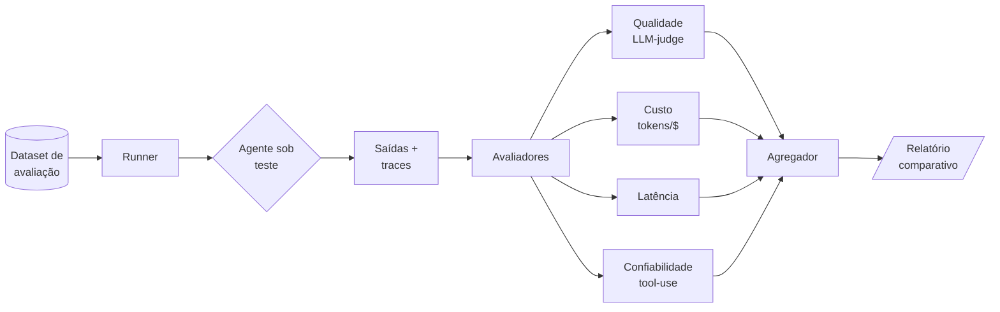

# 🧪 Agent Evals Framework

> Framework **genérico e open-source** para avaliação sistemática de agentes de IA — medindo **qualidade, custo, latência e confiabilidade** de forma reprodutível.

[](LICENSE)


## 🎯 Por que avaliar agentes?

Construir um agente é fácil. Saber se ele **funciona de forma confiável** é o verdadeiro desafio. Diferente de código tradicional, agentes de IA são **não-determinísticos**: a mesma entrada pode gerar saídas diferentes.

Este framework oferece uma abordagem estruturada para responder perguntas como:

- O agente **realmente resolve** a tarefa proposta?
- Qual o **custo médio** por execução (tokens/dinheiro)?
- Qual a **latência** e a variabilidade das respostas?
- O agente **alucina** ou usa as ferramentas corretas?
- Uma mudança no prompt **melhorou ou piorou** o desempenho?

## ✨ Características

- 📏 **Métricas multidimensionais**: qualidade, custo, latência, confiabilidade
- 🔁 **Reprodutível**: datasets versionados e execuções determinísticas quando possível
- 🧩 **Agnóstico de framework**: funciona com qualquer agente (LangGraph, CrewAI, AutoGen, custom)
- ⚖️ **LLM-as-a-judge + métricas determinísticas**: combina avaliação automática com regras objetivas
- 📊 **Relatórios comparativos**: compare versões de agentes lado a lado

## 🏗️ Visão geral



## 📚 Documentação

| Documento | Conteúdo |
|-----------|----------|
| [`docs/01-metodologia.md`](docs/01-metodologia.md) | Filosofia e metodologia de avaliação |
| [`docs/02-metricas.md`](docs/02-metricas.md) | Catálogo de métricas e como interpretá-las |
| [`docs/03-arquitetura.md`](docs/03-arquitetura.md) | Componentes: runner, avaliadores, agregador |
| [`docs/04-quickstart.md`](docs/04-quickstart.md) | Primeiros passos e exemplo mínimo |
| [`datasets/example-eval-set.json`](datasets/example-eval-set.json) | Dataset de exemplo (fictício) |

## 🚀 Início rápido

```bash
# 1. Clone o repositório
git clone https://github.com/Leandro-SM/agent-evals-framework.git
cd agent-evals-framework

# 2. (Futuro) instale as dependências
# pip install -r requirements.txt

# 3. Veja o guia de início rápido
cat docs/04-quickstart.md
```

Consulte [`docs/04-quickstart.md`](docs/04-quickstart.md) para um exemplo completo.

## 🗺️ Roadmap

- [x] Estrutura de documentação e metodologia
- [ ] Runner de execução de datasets
- [ ] Avaliadores de qualidade (LLM-as-a-judge)
- [ ] Métricas de custo e latência
- [ ] Geração de relatórios HTML/Markdown
- [ ] Integração com CI (regressão de qualidade em PRs)

## 🤝 Contribuindo

Contribuições são bem-vindas! Veja [`CONTRIBUTING.md`](CONTRIBUTING.md).

## 📄 Licença

Distribuído sob a licença MIT. Veja [`LICENSE`](LICENSE).

---

> ⚠️ Projeto **educativo e genérico**. Os dados de exemplo são fictícios e não representam nenhuma organização.
