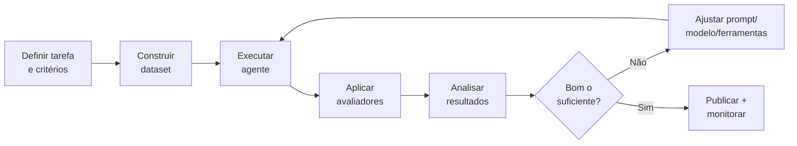

# 01 – Metodologia de Avaliação

Este documento descreve a **filosofia** por trás do framework e como estruturar uma avaliação confiável de agentes de IA.

## Princípio central

> "Se você não mede, você não melhora."

Agentes de IA são **não-determinísticos** e sensíveis a pequenas mudanças (prompt, modelo, temperatura, ferramentas). Avaliar de forma **sistemática e reprodutível** é o que separa um protótipo de um sistema pronto para produção.

## Os 4 pilares da avaliação

### 1. Qualidade (a tarefa foi resolvida?)
Mede se a saída do agente atende ao objetivo. Pode ser avaliada por:
- **Correspondência exata** (quando há resposta canônica)
- **Similaridade semântica** (embeddings)
- **LLM-as-a-judge** (um modelo avalia a resposta segundo critérios)
- **Validação de esquema** (a saída tem o formato esperado?)

### 2. Custo (quanto custa?)
- Tokens de entrada/saída
- Custo monetário estimado
- Número de chamadas a ferramentas/APIs

### 3. Latência (quão rápido?)
- Tempo total por execução
- Variabilidade (p50, p95, p99)

### 4. Confiabilidade (é consistente e seguro?)
- Taxa de sucesso vs. falhas/erros
- Uso correto de ferramentas (o agente chamou a ferramenta certa?)
- Robustez a entradas adversariais
- Ausência de alucinações

## Ciclo de avaliação recomendado

## Boas práticas

- **Dataset representativo**: inclua casos comuns, extremos (edge cases) e adversariais.
- **Baseline primeiro**: sempre tenha uma versão de referência para comparar.
- **Uma variável por vez**: para saber o que causou a mudança de desempenho.
- **Versione tudo**: dataset, prompts e configuração devem ser rastreáveis.
- **Cuidado com o juiz**: LLM-as-a-judge tem vieses; calibre com exemplos humanos.

## Armadilhas comuns

- ❌ Avaliar em poucos exemplos e generalizar demais.
- ❌ Usar o mesmo modelo como agente **e** como juiz sem cautela.
- ❌ Ignorar custo e latência, focando só em qualidade.
- ❌ Não versionar o dataset (resultados não reproduzíveis).
