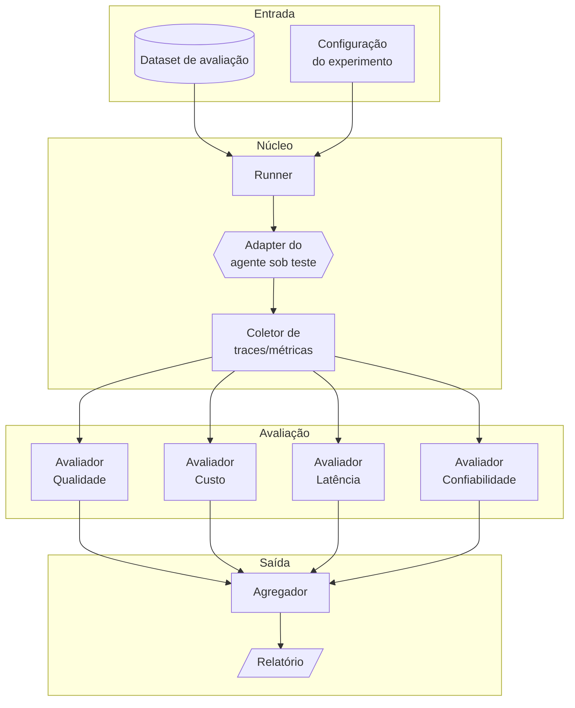

# 03 – Arquitetura

Este documento descreve os **componentes** do framework e como eles se conectam.

## Visão de componentes

## Componentes

### 1. Dataset
Coleção versionada de casos de teste. Cada caso tem uma **entrada**, opcionalmente uma **saída esperada** e **metadados** (categoria, dificuldade).

### 2. Adapter do agente
Camada de abstração que permite plugar **qualquer agente** (LangGraph, CrewAI, AutoGen ou custom). O framework só precisa de uma função `run(input) -> output + trace`.

### 3. Runner
Orquestra a execução: itera sobre o dataset, chama o agente, coleta saídas e traces, e trata erros/timeouts. Suporta execução paralela e múltiplas repetições (para medir variabilidade).

### 4. Coletor
Captura métricas brutas: tokens, tempo, chamadas de ferramenta, traces de raciocínio.

### 5. Avaliadores
Módulos independentes e plugáveis, um por dimensão (qualidade, custo, latência, confiabilidade). Cada avaliador recebe a saída + trace e produz pontuações.

### 6. Agregador
Consolida as pontuações por caso e no conjunto, calcula estatísticas (média, percentis) e compara contra o baseline.

### 7. Relatório
Gera saída legível (Markdown/HTML/JSON) com scorecard comparativo.

## Princípios de projeto

- **Modularidade**: cada avaliador é plugável e testável isoladamente.
- **Agnóstico de framework**: o adapter isola o agente do resto do sistema.
- **Reprodutibilidade**: seeds fixas e datasets versionados quando aplicável.
- **Extensibilidade**: adicionar uma nova métrica = adicionar um novo avaliador.
